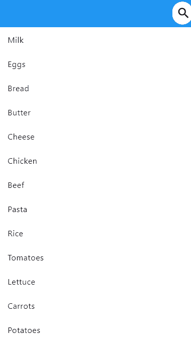

# Expandable Searchbar

### Example Code
```dart
ExpandableSearchbar(
            curve: Curves.linear,
            animationDurationInMilli: 500,
            contentColor: Colors.black,
            backgroundColor: Colors.white,
            width: 300,
            onSearch: () {
              setState(() {
                searching = true;
              });
            },
            controller: searchController,
            hintText: 'Search...',
            onHide: () {
                searchController.clear();
            },
          ),
```


| Simple use ||
|:-------------:|:-------------:|
|  ||