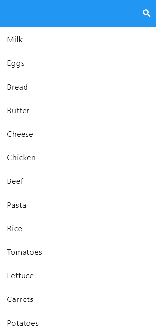

# example

Example project for Expandable Searchbar usage


Simple usage

```dart
 ExpandableSearchbar(
            curve: Curves.linear,
            animationDuration: 500,
            height: 50,
            contentColor: Colors.white,
            backgroundColor: Colors.blue,
            width: MediaQuery.sizeOf(context).width / 2,
            onSearch: () {
              setState(() {
                searching = true;
              });
            },
            controller: searchController,
            hintText: 'Search...',
            onHide: () {
              searchController.clear();
            },
          ),
```

Screenshot:
</td>
<td>

</td>
</tr>
</table>
